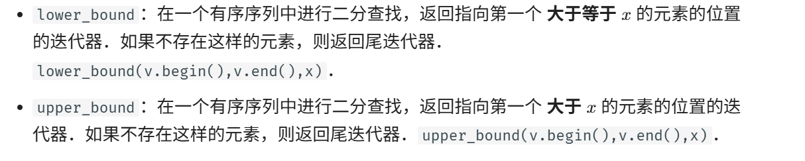

# 最小（大）子序列
### 最小（大）子序列长度问题
  时间复杂度：O(nlogn)  
  应该维护一个子序列使之依次变大或变小，二分查找，如果到了末尾就加上它自己，其长度就为最大长度。  
  代码：  
  ```c++
  #include<bits/stdc++.h>
    using namespace std;
    int main(void)
    {  
        vector<int>p;
        int n;
        while(cin>>n)
        {
            p.push_back(n);
        }
        vector<int>t;
        for(int i=0;i<p.size();i++)
        {
            if(!t.empty())
            {
                auto q=upper_bound(t.begin(),t.end(),p[i],greater<int>());
                if(q==t.end()){
                    t.push_back(p[i]);
                    //cout<<"tianjia\n";
                }
                else
                {
                   int w=q-t.begin();
                   t[w]=p[i];
                  //cout<<"xiugai\n";
              }
          }
           else {
              t.push_back(p[i]);
              //cout<<"chushitj\n";
          }
     }
     cout<<t.size()<<endl;
    }
  ```
    
  如果在括号后面加上greater<int>()就可以变成查找小于这个数的。  
  ```c++
  upper_bound(a.begin(),a.end(),t,greater<int>());
  lower_bound(a.begin(),a.end(),t,greater<int>());
  ```

