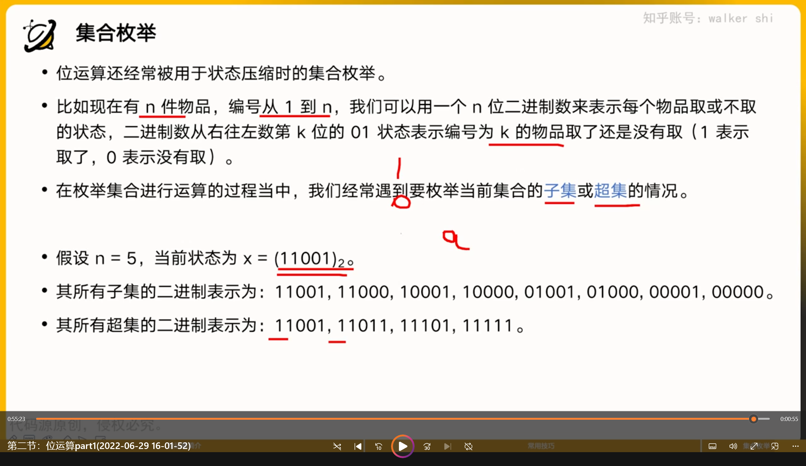

# 符号  
and & 按位与 两数同为零，结果为零，否则为一  
or | 按位或 两数同一，结果为一，否则为零  
xor ^ 按位异或 相同为零，不同为一   
! 逻辑非 ~ 按位非  
<<左移 相当于乘2的k次方 >>右移 相当于除2的k次方 （不建议对负数使用）（会进行补0）  
# int类型数字表示  
int 类型的变量会有32个bit来进行存储，第一位为符号位，正数为0，负数为1  
其中，用原码进行运算十分复杂，计算机中用补码来进行存储和运算  
按位非：实际上就是把它的补码中的每一位按位非后，在转换成原码。（建议不要使用，菜鸡把握不住）若操作的是无符号类型，按位非就是把原码中的每一位变成反码，就完了，比较简单。  
# 位运算应用（吓哭了）  
    
# 常见技巧  

```c++
//判断两数符号是否相同
int x,y
bool f =((x^y)<0>);
//判断一个数是不是2的幂次
int x;
bool f =(x^(x-1))==0
//得到右数第一个1和后面的0构成的数
int x;
int lowbit(x){
    return x-x&(x-1);
    //或者写
    return x&(-x);
}
//计算一个数的二进制有几个1
int x,c=0;
for(;x;c++){
    x=x&(x-1);
}
```
# 集合枚举  
位运算还经常被用于状态压缩时的集合枚举  
下图为简要介绍  
  
```c++
for(int i=0;i<1<<n;i++)//所有可能的i
{
    for(int j=i;j;j=(j-1)&i)//遍历特定i的非空子集
    {
        //j遍历了所有i的非空子集
    }
}
```