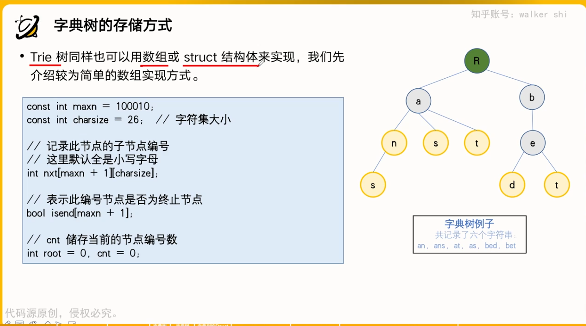
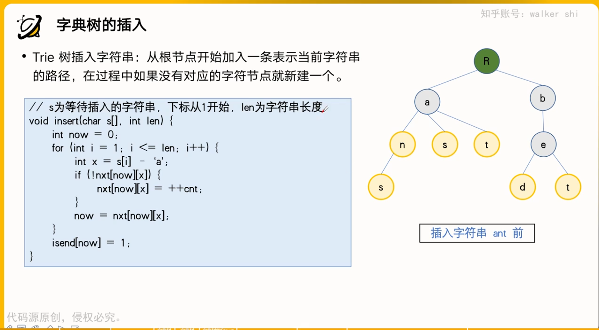
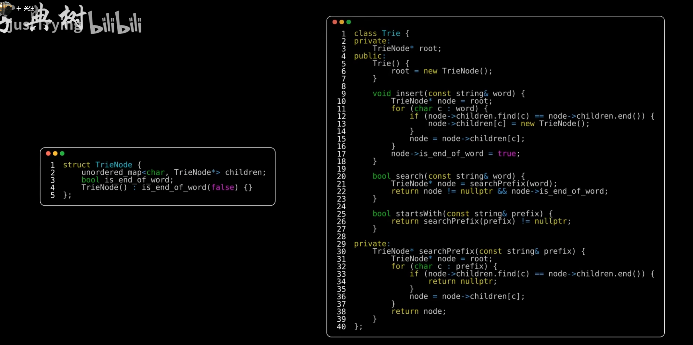

# 用途  
用于给了一大堆字符串，查找字符串是否出现过，因为它查找字符串时间复杂度为O(m)m为字符串长度，同时插入也为O(m)。  
# 存储方式  
  
```c++
const int maxn = 100010;//节点个数
const int charsize = 26;//字符集大小
int nxt[maxn+1][charsize];//nxt[a][b]表示在a节点的下一个字符有b，nxt[a][b]的值为下一个节点的下标，若为零，则为不存在下一个节点为b的情况。
bool isend[maxn+1];//记录该节点是否为终止节点，比如ab和aba。
int root =0,cnt=0;//记录当前节点编号数
```
# 插入 
  
```c++
void insert(char s[],int len)
{
    int now =0;
    for(int i=1;i<=len;i++)
    {
        int x = s[i]-'a';
        if(!nxt[now][x]){
            nxt[now][x]=++cnt;
        }
        now = nxt[now][x];
    }
    isend[now]=1;
}
```  
# 查找 
```c++
bool search(char s[],int len)
{
    int now =0;
    for(int i=1;i<=len;i++)
    {
        int x =s[i]-'a';
        if(!nxt[now][x]){
            return false;

        }
        now = nxt[now][x];
    }
    return isend[now];
}
```
# 结构体实现版  
  
这个版本适合字符集特别大的情况  
